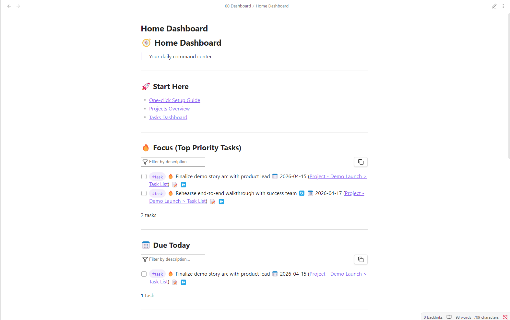
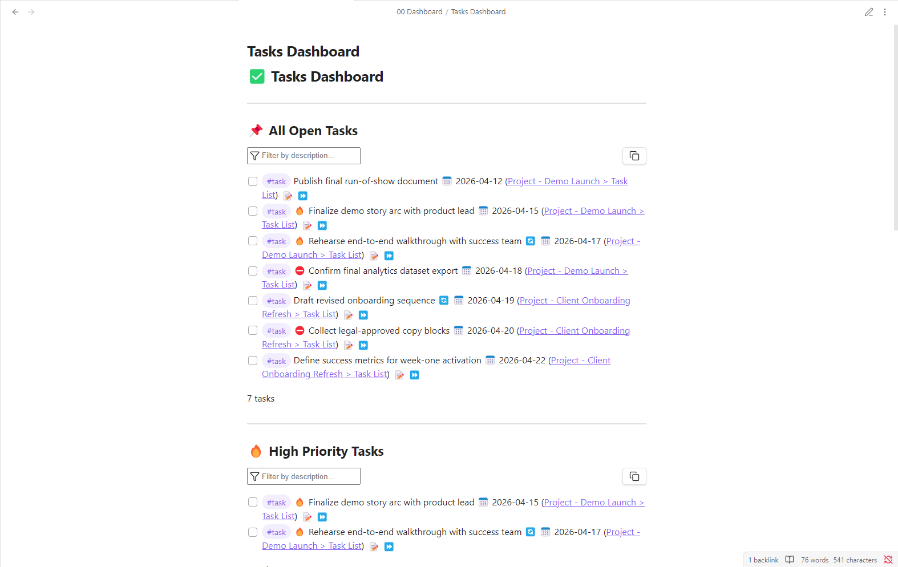
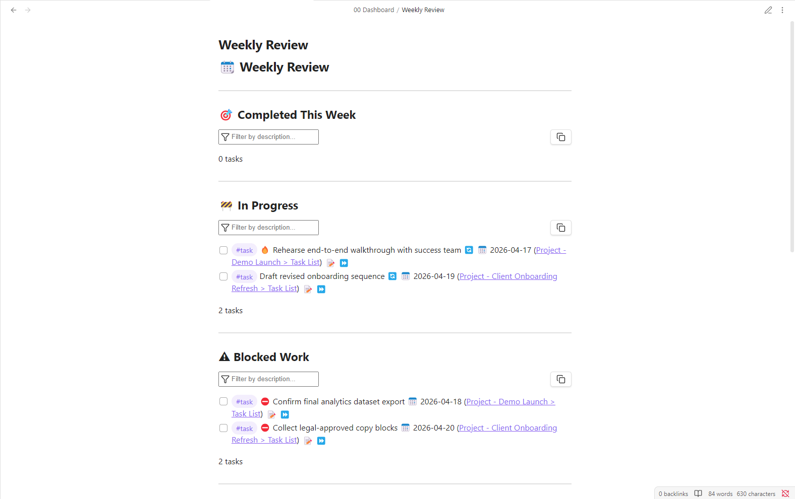
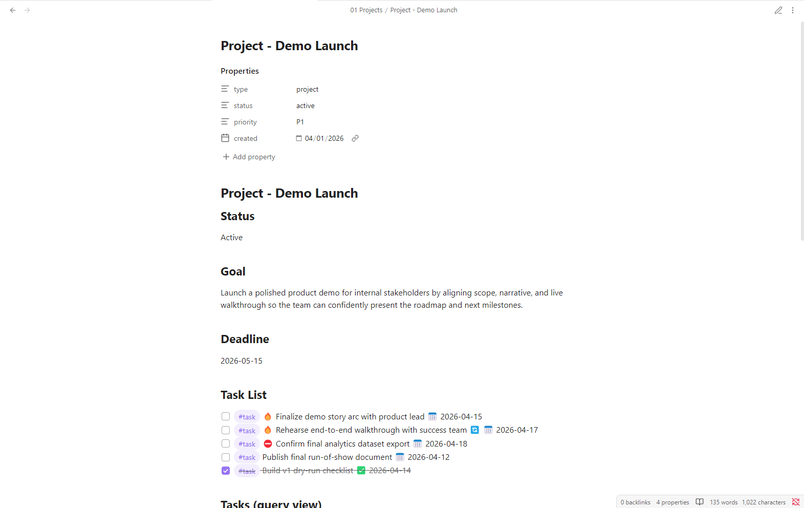
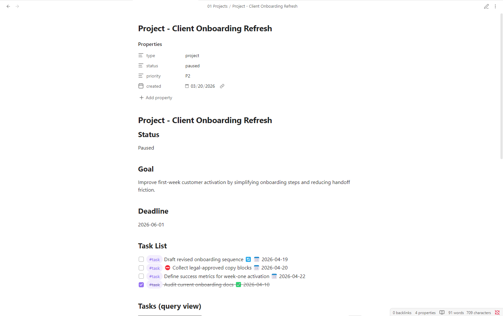
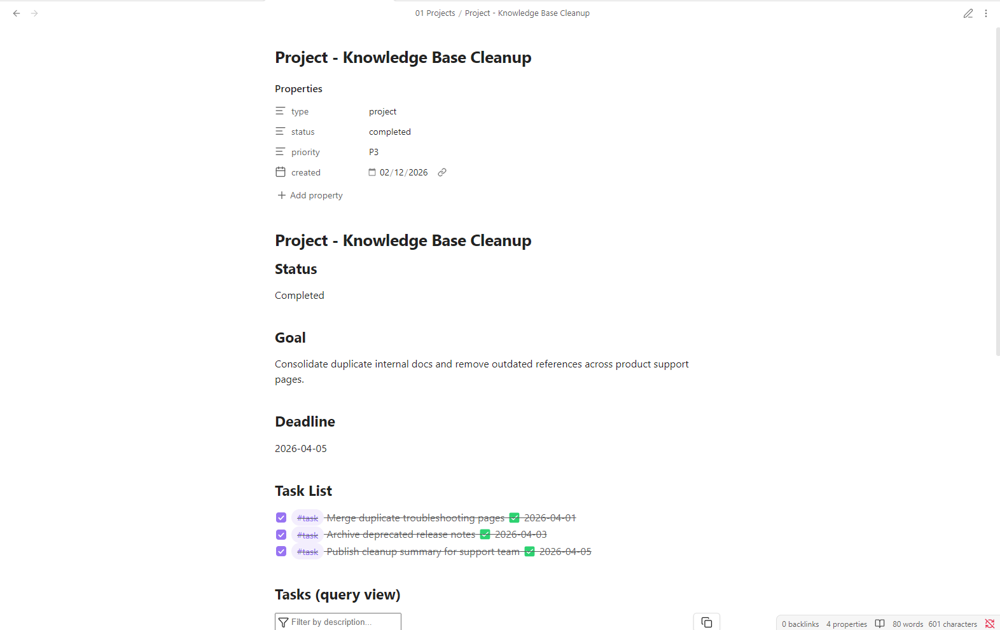

# Obsidian PM Starter

An opinionated Obsidian vault template for project management with dashboards, query-driven task views, and practical daily + weekly workflows.

[](https://github.com/)
[](./LICENSE)
[](https://nodejs.org/)

## Built for shipping, not setup

Stop piecing together a PM vault from scratch. This starter gives you a complete structure that is already wired for execution:

- Dashboard-first navigation so you always know what to do next.
- Project templates that stay Dataview-friendly by default.
- Task views that surface commitments, priorities, and stuck work.
- A review rhythm that keeps your system clean and current.

Open in Obsidian, run the setup checklist, and start managing real work in minutes.

## Explanation

This repository is a ready-to-use **Obsidian system for personal project management**.  
It combines:

- **Simple Markdown files** for long-term portability.
- **Dataview + Tasks plugins** for dynamic dashboards.
- **Reusable templates** for consistent capture and execution.
- **Daily and weekly routines** so the system remains useful over time.

You can use it as-is, or treat it as a foundation and customize naming, metadata, and workflows to fit your style.

## Preview Images

### Dashboards





### Project Examples





## Feature Showcase

### Command Center Dashboards

- `00 Dashboard/Home Dashboard.md` gives a single operational view for active work.
- `00 Dashboard/Tasks Dashboard.md` surfaces due, overdue, and high-priority tasks.
- `00 Dashboard/Weekly Review.md` guides reset, cleanup, and re-prioritization.

### Structured Vault Architecture

```text
00 Dashboard/   Command center notes and operational views
01 Projects/    Active and historical project notes
02 Areas/       Ongoing responsibilities
03 Resources/   Reference and source material
04 Archive/     Inactive content
Templates/      Reusable templates for projects, tasks, and reviews
.scripts/       Optional automation utilities
```

### One-Click Oriented Onboarding

- `00 Dashboard/One-click Setup Guide.md` walks new users through setup in order.
- `npm run plugins:install` installs compatible community plugins into `.obsidian/plugins`.
- Starter dashboards and examples make expected usage clear from day one.

### Workflow Loops That Stick

- **Daily loop (5 minutes):** capture, clarify, and execute.
- **Weekly loop (15-20 minutes):** review, close, archive, and refocus.
- Built-in routines reduce system drift and improve consistency.

## Quick Start

1. Click **Use this template** on GitHub, or clone this repository.
2. Open the vault folder in Obsidian.
3. Turn on **Community Plugins** and trust the vault.
4. Run plugin setup (optional but recommended):
   - `npm install`
   - `npm run plugins:install`
5. In Obsidian, enable installed plugins and set Templater's template folder to `Templates`.
6. Open `00 Dashboard/One-click Setup Guide.md` and complete the checklist.

## Required Plugins

This vault is designed around:

- Dataview
- Tasks
- Templater
- Calendar
- Kanban

The script at `.scripts/install-plugins.js` installs the latest compatible release assets into `.obsidian/plugins` and updates `.obsidian/community-plugins.json`.

## Starter Entry Points

If you are new to the vault, open these first:

- `00 Dashboard/Home Dashboard.md`
- `00 Dashboard/One-click Setup Guide.md`
- `00 Dashboard/Projects Overview.md`
- `00 Dashboard/Tasks Dashboard.md`
- `00 Dashboard/Weekly Review.md`

## Tips for Customization

- Add your own metadata conventions in template frontmatter.
- Rename or remove dashboards you do not use.
- Extend task markers (for example, `🔥`, `⛔`, `🔄`) to fit your system.
- Keep project notes in `01 Projects` with `type: project` for Dataview compatibility.

## License

Distributed under the [MIT License](./LICENSE).
